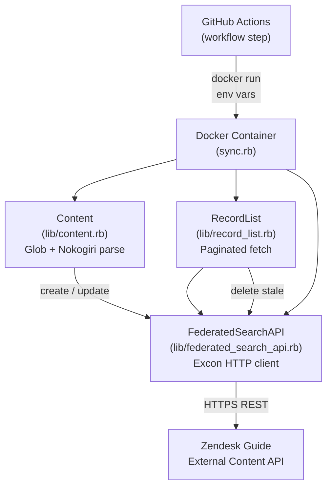

# index-content-in-guide-action

## System Overview

This repository is a Docker-based GitHub Action that synchronizes local HTML files into Zendesk Guide's Federated Search index. It reads HTML files from a configurable directory, extracts titles and body text using Nokogiri, then calls the Zendesk External Content API to create, update, or delete search records. The action is designed to run as a CI step after a static-site build (e.g., Hugo) to keep Help Center search results up to date.

## Architecture Diagram

## Component Map

| File | Responsibility |
|------|---------------|
| `sync.rb` | Entry point — orchestrates load, diff, create/update/delete cycle |
| `action.yml` | GitHub Action definition — maps action inputs to env vars |
| `Dockerfile` | Docker image build — installs gems, sets entrypoint to `sync.rb` |
| `lib/federated_search_api.rb` | HTTP client wrapping Zendesk External Content API endpoints |
| `lib/record_list.rb` | Enumerable over all existing records, handles cursor-based pagination |
| `lib/search_record.rb` | Value object for a single Zendesk external content record |
| `lib/content.rb` | Parses HTML files into `Content` structs (title, body, id, url) |
| `lib/colored_logging_formatter.rb` | ANSI-colored Logger formatter for CI output readability |
| `test/` | Fixture HTML files used by the CI integration test |

## Request Flow

1. GitHub Actions runs the Docker container, injecting all inputs as environment variables
2. `sync.rb` changes to `WORKING_DIR`, instantiates logger and loads all HTML files via `Content.load_all`
3. `Content.load_all` globs `CONTENT_DIR/**/*.html`, parses each with Nokogiri, extracts title and `CONTENT_CSS_SELECTOR` text
4. Each `Content` gets a deterministic ID: `MD5(source_id + file_path)`
5. `sync.rb` validates no duplicate IDs exist across the loaded files (raises if found)
6. `RecordList` fetches all existing Zendesk records matching `source_id` + `type_id`, handling cursor pagination
7. For each local content item: if no matching record exists → `POST` (create); if record exists → `PUT` (update) and remove from the existing list
8. Any records remaining in the existing list (not matched) are `DELETE`d (stale records)

## Key Design Decisions

### Docker-Based Action
The action uses `runs: using: docker` rather than `composite` or `node`. This gives a stable, hermetic Ruby environment without requiring consumers to pre-install Ruby on their runners.

### Deterministic Content IDs via MD5
Content IDs are `MD5(source_id + file_path)`, not content hashes. This means the same file always gets the same ID regardless of content changes, enabling stable update-vs-create decisions. MD5 is used only as a stable identifier here, not for security.

### Filter by Source and Type
`RecordList` filters records by both `source_id` AND `type_id` even though the API returns all records for the account. This allows multiple action invocations with different type/source pairs to coexist without interfering.

### Cursor-Based Pagination
The Zendesk API returns paginated results. `RecordList` transparently handles `has_more` + `after_cursor` so callers see a flat `Enumerable`.

## External Dependencies

| Service | Protocol | Location | Purpose |
|---------|----------|----------|---------|
| Zendesk Guide External Content API | HTTPS REST | `lib/federated_search_api.rb` | Create/update/delete search index records |
| GitHub Actions runner | Docker | `action.yml`, `Dockerfile` | Action execution environment |

## Cross-Cutting Concerns

### Configuration
All configuration is via environment variables accessed through `ENV.fetch`. In the action, these come from `action.yml` input mappings. Locally, they come from a `.env` file loaded by `dotenv` (development group only).

### Observability
Structured logging via Ruby `Logger` with `ColoredLoggingFormatter`. Log levels used: `debug` (pagination cursors), `info` (progress), `warn` (deletions), `error` (API errors). All output goes to STDOUT for capture by the Actions runner.

### Error Handling
API errors are caught as `Excon::Error::Client`, the response body is logged at `error` level, and the exception is re-raised to fail the action step. This surfaces Zendesk API error messages directly in CI logs.
